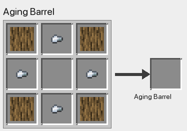
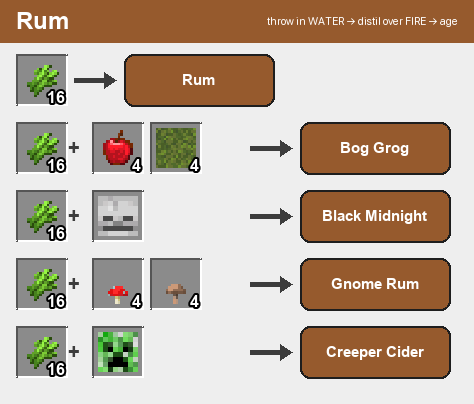
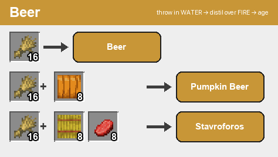
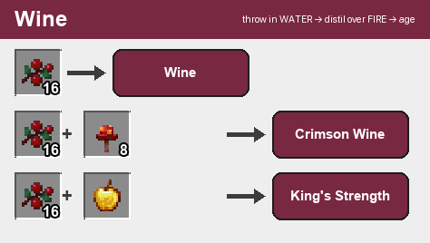
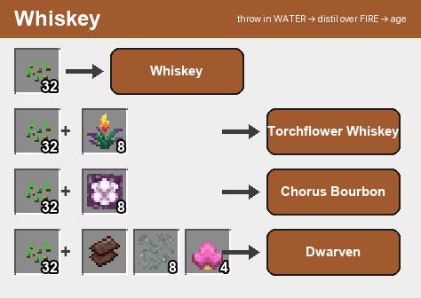
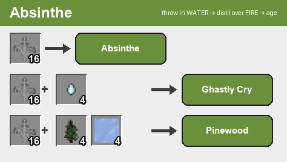
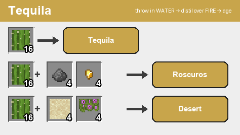
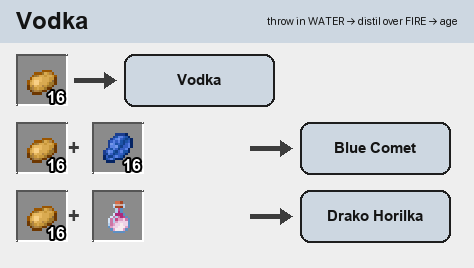

# 📖 Server Guide — Where to Find Stuff + DinoBriks Recipes

Two things this guide covers:
1. **Where to find the raw materials** for the drugs & meth (plants, raw zinc, etc.).
2. **DinoBriks Rum recipes with pictures** — because DinoBriks brewing does **NOT show in JEI** (it's a hidden datapack system). Everything else (drug crafting, Broken Bad meth steps) **is** in JEI — just search the item and JEI shows the recipe.

---

# 🌿 Where to find the drug plants

Each drug plant only spawns in certain biomes, and only in **newly-explored chunks** (~1 patch per **20 chunks**). Go to fresh, never-loaded areas of the right biome. They grow in small **patches** — find one, look around, there are more.

| Plant | Where it spawns |
|-------|-----------------|
| 🌿 **Weed** | **Jungle** (jungle, sparse jungle, bamboo jungle) |
| 🍃 **Coca** | **Windswept hills / gravelly hills / windswept forest** |
| 🌺 **Poppy** | **Plains, sunflower plains, meadow** |
| 🚬 **Tobacco** | **Savanna** (all savanna types) |
| 🍄 **Shrooms** | **Dark forest, forest, birch forest, flower forest, swamp, mangrove swamp** |

**Farming them:** break a wild plant → get **seeds** → plant on tilled dirt (water + light) → let it fully grow → harvest = **product + 1 seed back + 5% chance of a bonus seed**.

---

# 🧪 Where to find the meth (Broken Bad) materials

You don't need to memorize recipes — **search the item in JEI and it shows every step.** You just need to know where the *raw* stuff comes from:

| Material | Where to get it |
|----------|-----------------|
| **Ephedra** | Craft **Ephedra Seeds** (JEI), then grow & harvest them like a crop |
| **Sudafed** | Craft a **Box of Sudafed** (JEI), open it for Sudafed pills |
| **Raw Zinc** | Mine **Zinc Ore** — spawns underground from **Y −63 up to Y 70** (drops Raw Zinc → smelt into Zinc Ingot) |
| **Copper** | Mine **Copper Ore** (normal vanilla copper) |
| **Redstone / Coal** | Mine underground like normal |
| **Brass** | Made from **Zinc + Copper** in Create (JEI shows it) |

Everything else in the meth chain (Pseudoephedrine → Methamphetamine → Blue Meth, plus phosphorus, iodine, methylamine, catalysts) is **crafted from those** — **open JEI, search "Methamphetamine" or "Blue Methamphetamine", and follow the recipe tree backwards.** It's a multi-step Create factory.

---

# 🥃 DinoBriks Rum — full recipes (with pictures)

⚠️ **These recipes are NOT in JEI.** DinoBriks brewing is a hidden system, so here's exactly how it works, with real recipe pictures.

## How brewing works (3 steps)

1. **FERMENT** — throw the ingredient stack (shown below) onto the **ground / into water**. Wait ~5 seconds; it turns into a *fermented* item.
2. **DISTIL** — throw that fermented item over **fire** (a campfire, fire, or lava below it). It becomes the raw spirit.
3. **AGE** — drop it into an **Aging Barrel** and wait in-game **days**. The **wood the barrel is made of** and **how many days** it ages change the final drink.

> Throw items by pressing **Q** (drop key) while looking at the spot. Whole stacks in the exact counts below.

## 🛢️ Step 0 — Craft the Aging Barrel

Build a **2×2 ring of these** and it becomes an Aging Barrel automatically.

## The 7 drink families

Each card shows: **base ingredient → base drink**, then the **special recipes** (base + extra items → a special drink).

### Rum — ferment **Sugar Cane**

### Beer — ferment **Wheat**

### Wine — ferment **Sweet Berries**

### Whiskey — ferment **Wheat Seeds** (32!)

### Absinthe — ferment **Fern**

### Tequila — ferment **Cactus**

### Vodka — ferment **Potatoes**

## ⏳ Aging — wood type + days matters

After distilling, drop the spirit in an Aging Barrel. It ages in steps: **4 → 8 → 12 → 16 days**. The **wood** you built the barrel from changes the result:

| Drink | Barrel wood | Days | Becomes |
|-------|-------------|------|---------|
| Rum | **Oak** | 16 | **Golden Rum** |
| Beer | **Birch** | 4 | **Pale Beer** |
| Beer | **Dark Oak** | 4 | **Stout Beer** |
| Wine | any | 8 → 16 | Half Well-Aged → **Well-Aged Wine** |

Longer aging = higher quality (more "stars"). Experiment with different woods and times to discover all the premium variants.

---

# ⚡ Tips
- **JEI covers the drugs & meth** — search any item, click it for the recipe, click again for what it makes. That's why this guide only pictures DinoBriks.
- **Counts must be exact** — e.g. 16 sugar cane, but **32** wheat seeds, and specials need their exact extra items too.
- **The server** already runs the realistic plant spawns + item cleanup. Explore, farm, cook, and brew. 🍺
